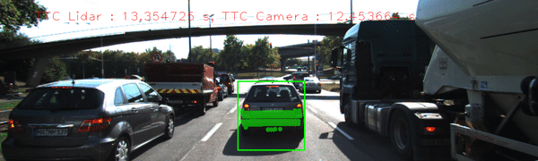
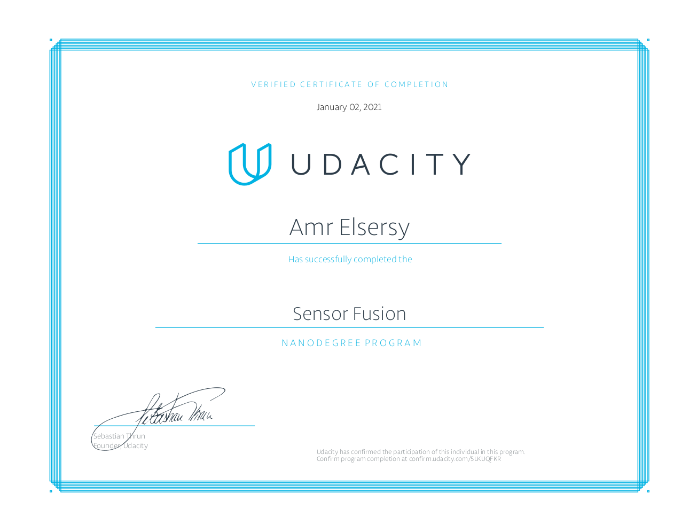

# Sensor Fusion Nanodegree

### LIDAR Obstacle Detection 
Obstacle Detection on a real 3D Point Cloud using C++ with LIDAR preprocessing such as Segmentation, Clustring and filteration. 

### Trcking with Time to Collision Detection  
A Vision based TTC detection based on Object detection using Yolo & tracking using keypoint matching.

### Radar 
Radar Obstacle & Velocity Detection using 2nd Fast fourier transformations & 2D CFAR-CA

### Unscented Kalman filter 
Unscented Kalman Filter to estimate the state of multiple cars on a highway using noisy lidar and radar measurements

### Udacity Certificate 

